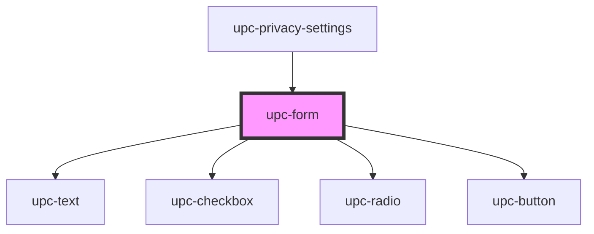

# upc-form

<!-- Auto Generated Below -->

## Properties

| Property   | Attribute | Description | Type      | Default     |
| ---------- | --------- | ----------- | --------- | ----------- |
| `settings` | --        |             | `Setting` | `undefined` |

## Dependencies

### Used by

 - [upc-privacy-settings](../privacy-settings)

### Depends on

- [upc-text](../text)
- [upc-checkbox](../checkbox)
- [upc-radio](../radio)
- [upc-button](../button)

### Graph

----------------------------------------------

*Built with [StencilJS](https://stenciljs.com/)*
