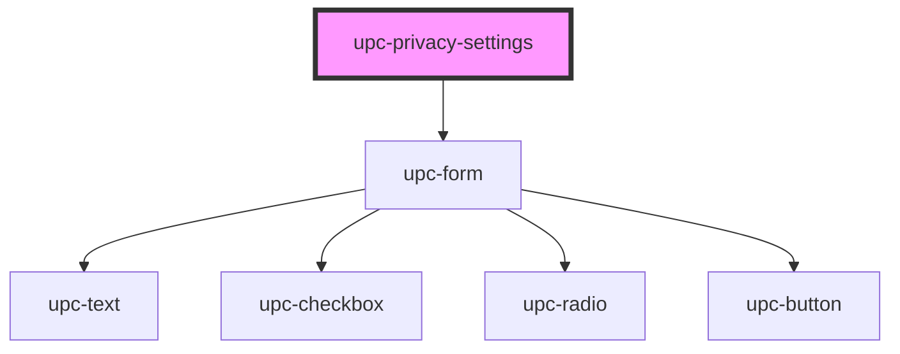

# upc-privacy-settings

<!-- Auto Generated Below -->

## Properties

| Property    | Attribute    | Description | Type      | Default     |
| ----------- | ------------ | ----------- | --------- | ----------- |
| `baseApi`   | `base-api`   |             | `string`  | `'/'`       |
| `productId` | `product-id` |             | `string`  | `undefined` |
| `settings`  | --           |             | `Setting` | `undefined` |

## Dependencies

### Depends on

- [upc-form](../form)

### Graph

----------------------------------------------

*Built with [StencilJS](https://stenciljs.com/)*
