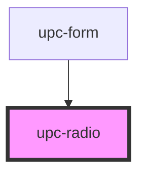

# upc-radio

<!-- Auto Generated Below -->

## Properties

| Property  | Attribute | Description                          | Type      | Default     |
| --------- | --------- | ------------------------------------ | --------- | ----------- |
| `checked` | `checked` | If `true`, the checkbox is selected. | `boolean` | `false`     |
| `label`   | `label`   | The label                            | `string`  | `undefined` |
| `name`    | `name`    | The name                             | `string`  | `undefined` |

## Dependencies

### Used by

 - [upc-form](../form)

### Graph

----------------------------------------------

*Built with [StencilJS](https://stenciljs.com/)*
