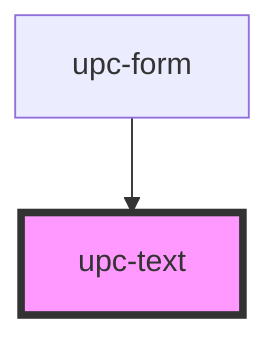

# upc-text

<!-- Auto Generated Below -->

## Properties

| Property | Attribute | Description                                   | Type     | Default     |
| -------- | --------- | --------------------------------------------- | -------- | ----------- |
| `label`  | `label`   | The label                                     | `string` | `undefined` |
| `name`   | `name`    | The name                                      | `string` | `undefined` |
| `value`  | `value`   | The initial value. Can be updated at runtime. | `string` | `undefined` |

## Dependencies

### Used by

 - [upc-form](../form)

### Graph

----------------------------------------------

*Built with [StencilJS](https://stenciljs.com/)*
